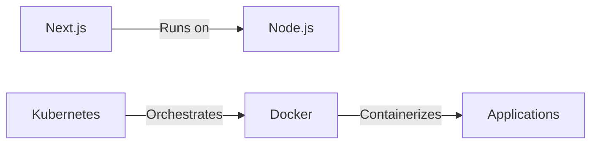
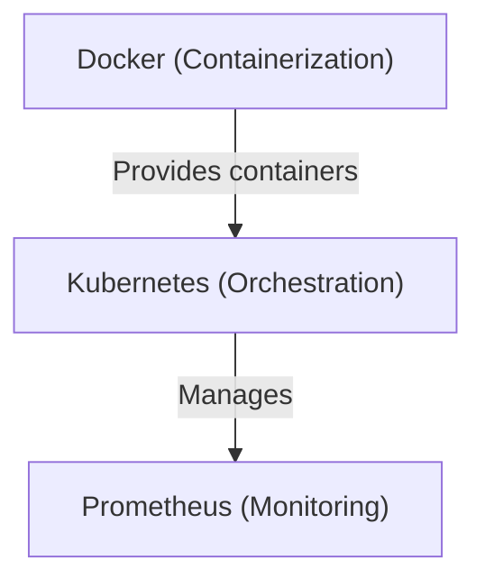

# 🚀 TRY IT NOW - 5 Minute Test

This is the **fastest way to see it working**. These public repos are pre-configured!

---

## ⏱️ 5 Minute Setup

### Step 1: Get GitHub Token (2 min)

```bash
# Go to this link:
https://github.com/settings/tokens

# Click: Generate new token (classic)

# Fill in:
Token name: blueprint-generator
Scopes:     ✅ repo
            ✅ read:user
            ✅ read:org

# Click: Generate token
# Copy the token (appears once, save it!)
# Format: ghp_xxxxxxxxxxxxxxxxxxx
```

### Step 2: Add Token (1 min)

```bash
# Edit .env.local
GITHUB_TOKEN="ghp_paste_your_token_here"
OPENAI_API_KEY="sk-proj-..."  # Already set
OPENAI_MODEL="gpt-4-mini"     # Keep as-is
```

### Step 3: Run Server (1 min)

```bash
npm run dev

# Wait for: ✓ Ready in XXXms
# See: ▲ Next.js 16.1.1
#      - Local: http://localhost:3000
```

### Step 4: Open Browser (1 min)

```
http://localhost:3000
↓
Click "Demo Blueprint"
↓
See chat interface
↓
Type a prompt (see below)
```

---

## 💬 Try These Prompts

### Simple Prompts

**Prompt 1**:
```
Show me the architecture of these open source projects.
What do they each do?
```

**Prompt 2**:
```
What programming languages are used in these projects?
Make a table.
```

**Prompt 3**:
```
Group these projects by category:
- Infrastructure
- Runtime/Execution
- Libraries
- Tools
```

### Verification Prompts

**Prompt 4**:
```
Search for Docker/Containerization usage.
Which projects use containers?
```

**Prompt 5**:
```
Find configuration files (Dockerfile, kubernetes manifests, terraform).
What deployment methods are used?
```

### Analysis Prompts

**Prompt 6**:
```
If I were building a microservices system, 
which of these would be foundational?
Create a dependency diagram.
```

---

## What You'll See

**Response includes**:

1. **Mermaid Diagram** - Visual architecture showing relationships
2. **Evidence Used** - Which files were read to create it
3. **Analysis** - Insights about the projects

**Example response**:
```
Here's the architecture:



Evidence used:
- vercel/next.js:README.md
- nodejs/node:README.md
- kubernetes/kubernetes:README.md
- docker/cli:README.md

These projects form a modern development stack...
```

---

## 🎯 What to Try

### First Try (Start Simple)
```
"Show me these projects"
```

### Then Try (Get Details)
```
"What are the main programming languages?"
```

### Then Explore (Get Specific)
```
"Which ones run in containers?"
```

### Advanced (Ask Complex Questions)
```
"Create a system architecture using 4-5 of these projects"
```

See [PROMPTS.md](./PROMPTS.md) for 28 detailed example prompts!

---

## 🎁 Pre-Configured Repos

These public repos are already set up:

1. **vercel/next.js** - React framework for web apps
2. **nodejs/node** - JavaScript runtime
3. **kubernetes/kubernetes** - Container orchestration
4. **prometheus/prometheus** - Monitoring & alerting
5. **docker/cli** - Container platform
6. **apache/kafka** - Message broker
7. **hashicorp/terraform** - Infrastructure as code
8. **grpc/grpc** - RPC framework
9. **elastic/elasticsearch** - Search engine
10. **etcd-io/etcd** - Distributed key-value store

**All public** = Your GitHub token works immediately!

---

## ✅ Success Checklist

- [ ] Got GitHub token
- [ ] Added to `.env.local`
- [ ] Ran `npm run dev`
- [ ] Browser opened to http://localhost:3000
- [ ] Clicked "Demo Blueprint"
- [ ] Typed a prompt
- [ ] Got a diagram back
- [ ] Saw "Evidence used" section

**If all checked**: It's working! 🎉

---

## 🐛 Troubleshooting

| Issue | Fix |
|-------|-----|
| "GITHUB_TOKEN missing" | Add token to `.env.local` |
| "Connection refused" | Wait 30sec for server, then refresh |
| "Can't read file" | Token might not have repo scope |
| "ChatAPI error" | Check OPENAI_API_KEY in `.env.local` |
| "Module not found" | Run `npm install` |

---

## 📊 What's Happening Behind the Scenes

```
1. You type prompt
   ↓
2. Sent to /api/blueprints/demo/chat
   ↓
3. LLM (OpenAI) receives message + tools
   ↓
4. LLM decides what to read (README.md, configs, etc)
   ↓
5. GitHub API fetches files (guarded by scope)
   ↓
6. LLM processes files + generates diagram
   ↓
7. Response streamed back to browser
   ↓
8. Diagram renders in chat
   ↓
9. You can chat follow-ups to refine
```

---

## 🎓 Example: What You Might See

**Your prompt**:
```
Show me how Docker, Kubernetes, and the other projects relate
```

**LLM actions**:
- Reads docker/cli:README.md
- Reads kubernetes/kubernetes:README.md
- Searches for "docker" in kubernetes repo
- Searches for "container" in all repos
- Reads prometheus:README.md (monitoring)

**AI Response**:
```
Docker is the foundational container platform. Kubernetes orchestrates Docker containers.
Prometheus monitors both.



Evidence used:
- docker/cli:README.md (lines 1-50)
- kubernetes/kubernetes:README.md (mentioned Docker integration)
- prometheus/prometheus:README.md (mentions Kubernetes targets)
```

---

## 🚀 Ready? Let's Go!

1. Open: https://github.com/settings/tokens
2. Generate token
3. Copy token
4. Edit `.env.local`, add token
5. Run: `npm run dev`
6. Visit: http://localhost:3000
7. Click: "Demo Blueprint"
8. Type: "Show me the architecture"
9. See: Mermaid diagram
10. Explore: Try more prompts!

**Time: ~5 minutes** ⏱️

---

## Next Steps After Testing

- **Explore more**: Try prompts from [PROMPTS.md](./PROMPTS.md)
- **Read docs**: Check out [README.md](./README.md)
- **Add your repos**: Update `lib/blueprintsStore.ts` with your own
- **Deploy**: See [README.md](./README.md) for deployment options

---

## Questions?

| Need | See |
|------|-----|
| Quick reference | [REFERENCE.md](./REFERENCE.md) |
| More prompts | [PROMPTS.md](./PROMPTS.md) |
| Full docs | [README.md](./README.md) |
| Getting started | [START.md](./START.md) |

---

**Enjoy! 🎉**

This is a fully functional blueprint generator. Have fun exploring!
