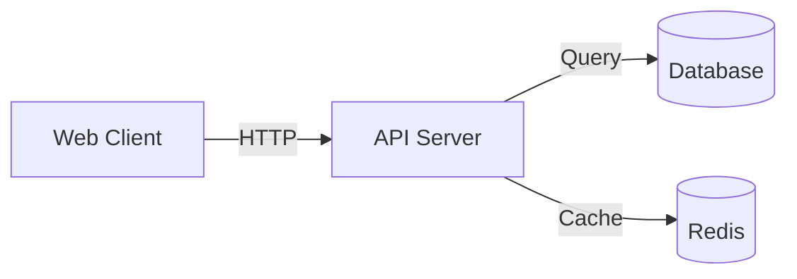
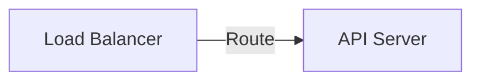

# 🎯 Getting Started - Blueprint Generator

## Welcome! 👋

You have a **fully working Blueprint Generator**. This file gets you started in 5 minutes.

---

## What Is This?

A chat interface where you:
1. 💬 Ask AI to generate architecture diagrams
2. 🔍 AI reads public GitHub repos to gather evidence
3. 📊 AI creates Mermaid diagrams
4. ✏️ You chat to refine them

**Example**:
```
You: "Show me the architecture of these projects"
AI: [reads README.md, searches for patterns]
    [creates Mermaid diagram showing systems]
    [shows evidence: which files it read]
```

**Default Demo Repos** (all public!):
- vercel/next.js, kubernetes/kubernetes, nodejs/node, prometheus/prometheus, docker/cli, apache/kafka, hashicorp/terraform, grpc/grpc, elastic/elasticsearch, etcd-io/etcd

---

## Quick Start (4 Steps)

### Step 1: Get GitHub Token (2 min)

Go to: https://github.com/settings/tokens

1. Click "Generate new token (classic)"
2. Name it: `blueprint-generator`
3. Check these boxes:
   - ✅ repo
   - ✅ read:user
   - ✅ read:org
4. Click "Generate token"
5. **Copy the token immediately** (you won't see it again!)

It looks like: `ghp_xxxxxxxxxxxxxxxxxxxxx`

### Step 2: Add Token to Config (1 min)

Edit `.env.local`:
```bash
GITHUB_TOKEN="ghp_xxxxxxxxxxxxx"     # ← Paste your token here
OPENAI_API_KEY="sk-proj-..."          # Already has a key
OPENAI_MODEL="gpt-4-mini"             # Don't change
```

### Step 3: Run It (30 sec)

```bash
npm run dev

# You'll see:
# ▲ Next.js 16.1.1
# ✓ Ready in 1234ms
# - Local: http://localhost:3000
```

Open **http://localhost:3000** in your browser.

### Step 4: Try It Out! (30 sec)

1. Click "Demo Blueprint"
2. Try one of these prompts:
   - "Show me the architecture of these open source projects"
   - "What programming languages are used?"
   - "Which are infrastructure vs applications?"

**That's it!** The demo uses 10 popular public repos, so you can test immediately! ✅

---

## Use It

### Click "Demo Blueprint"

You'll see a chat interface.

### Type a Prompt

Try one of these:
```
Show me the architecture of these open source projects

or

What programming languages are used in these projects?

or

Group these projects by their primary purpose
```

See [PROMPTS.md](./PROMPTS.md) for 28 example prompts!

### Watch It Work

The AI will:
1. Read README and docs from the public repos
2. Search for patterns and keywords
3. Generate a Mermaid diagram
4. Show you the evidence

---

## Example

```
You: "Show me the architecture"

AI: Reading files... Searching for patterns... 

Generated diagram:



Evidence used:
- your-org/api:README.md
- your-org/api:docker-compose.yml
- your-org/api:package.json
```

---

## More Examples

### Verify Technologies
```
You: "Does this use Kafka?"

AI: [searches for kafka]
    
    Yes, in your-org/processor repo:
    - Found kafka dependency in package.json
    - Found kafka configuration in config.yaml
```

### Refine Diagrams
```
You: "Add a load balancer at the top"

AI: [updates existing diagram]

Updated diagram:


```

---

## Common Questions

### Q: What if I don't have my repos yet?
A: Use any GitHub repos for testing:
```typescript
repos: [
  "nodejs/node",
  "facebook/react",
  "kubernetes/kubernetes",
]
```

### Q: Can I change the repos later?
A: Yes! Edit `lib/blueprintsStore.ts` anytime.

### Q: What if my token expires?
A: Just get a new one and update `.env.local`

### Q: Is this secure?
A: Yes! Only accesses repos you specify. Token stays local.

### Q: Can I customize the prompts?
A: Yes! Edit `app/api/blueprints/[id]/chat/route.ts`

---

## Troubleshooting

### "Module not found: ai"
**Problem**: Dependencies not installed  
**Fix**: Run `npm install`

### "Missing GITHUB_TOKEN"  
**Problem**: Token not in `.env.local`  
**Fix**: Add your GitHub token

### "Repo not in Blueprint scope"
**Problem**: Repo name is wrong  
**Fix**: Check spelling in `lib/blueprintsStore.ts`

### "Failed to read file"
**Problem**: Token doesn't have access  
**Fix**: Make sure token has `repo` scope

### "Port 3000 already in use"
**Problem**: Something else is on port 3000  
**Fix**: Run `lsof -i :3000` and kill process, or use different port

---

## Next Steps

### Immediate
- [ ] Get GitHub token
- [ ] Update `.env.local`
- [ ] Update repos in `lib/blueprintsStore.ts`
- [ ] Run `npm run dev`
- [ ] Test at http://localhost:3000

### After Testing
- [ ] Read [QUICKSTART.md](./QUICKSTART.md) for more options
- [ ] Check [EXAMPLES.md](./EXAMPLES.md) for advanced config
- [ ] See [README.md](./README.md) for full documentation

### For Production
- [ ] Add database (currently in-memory)
- [ ] Add authentication
- [ ] Add rate limiting
- [ ] Deploy to cloud (Vercel, Railway, etc)

---

## Files You Need

| File | Action |
|------|--------|
| `.env.local` | ✏️ Add GITHUB_TOKEN |
| `lib/blueprintsStore.ts` | ✏️ Update repos |
| `QUICKSTART.md` | 📖 Read for details |
| `EXAMPLES.md` | 📖 See examples |
| Everything else | 👀 Reference only |

---

## Key Concepts

### Blueprint
One chat session about one architecture.  
Has: repos, messages, diagram, file evidence.

### Repos
The GitHub repos the AI can read.  
Only these are accessible - safe!

### Tools
AI can use 3 tools:
1. Read files
2. List files
3. Search code

### Diagram
AI generates Mermaid diagrams.  
You can chat to refine them.

### Evidence
Shows which files the AI read.  
Proves the diagram is grounded.

---

## Architecture (Simple)

```
Your Browser
    ↓ (you type)
Frontend Chat UI
    ↓ (sends message)
Backend API
    ↓ (needs tools)
GitHub API
    ↓ (reads repos)
Your GitHub
```

---

## Performance Tips

- Fewer repos = faster responses
- Shorter prompts = faster responses
- More specific queries = better results
- Include "evidence please" for verification

---

## Support

- **Quick answers**: [REFERENCE.md](./REFERENCE.md)
- **Setup help**: [QUICKSTART.md](./QUICKSTART.md)
- **Examples**: [EXAMPLES.md](./EXAMPLES.md)
- **Full docs**: [README.md](./README.md)
- **Lost?**: [INDEX.md](./INDEX.md)

---

## Success Checklist

When this is true, you're done:
- [x] `npm run dev` runs
- [x] http://localhost:3000 loads
- [x] Can see "Demo Blueprint" button
- [x] Click button = chat page loads
- [x] Type a message
- [x] Get a response with a diagram
- [x] See evidence list

---

## You're All Set! 🚀

Everything is built and ready. Just add your token and repos, then start chatting!

**Time to first diagram: ~5 minutes**

---

## One More Thing

This system is production-ready but uses in-memory storage (diagrams disappear on restart). For production:
1. Add a database (PostgreSQL recommended)
2. Add authentication
3. Deploy to your cloud

See [README.md](./README.md) for details.

---

**Ready?** Go get that GitHub token! 🎉

https://github.com/settings/tokens
